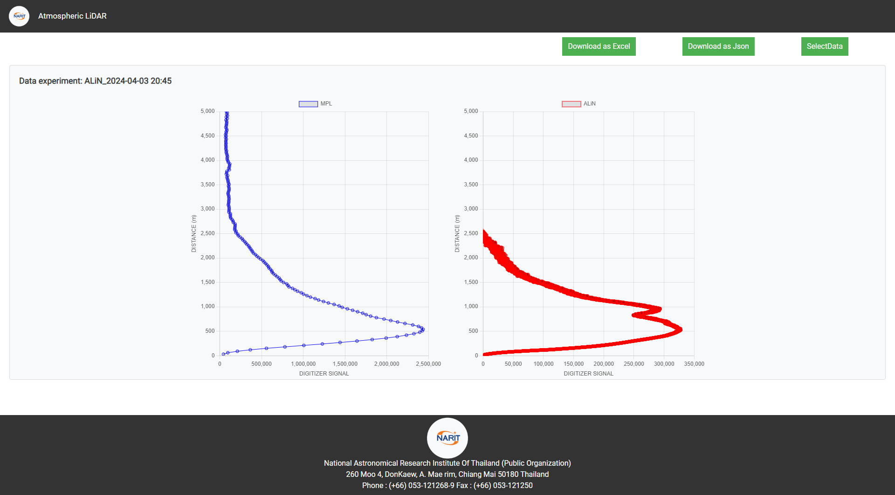

# Atmospheric LiDAR Data Visualization

## Overview
This project provides a web-based visualization for Atmospheric LiDAR data, allowing users to view and analyze data through interactive charts. It includes features for downloading data in Excel and JSON formats, and options to select specific data sets for visualization.

## Features
- **Visualization of LiDAR Data:** Interactive line charts displaying data from a JSON API.
- **Data Download:** Users can download the data as Excel files or JSON.
- **Interactive Data Selection:** A dropdown menu allows users to select specific datasets for visualization.

## Technologies Used
- HTML/CSS/JavaScript
- Bootstrap for responsive design
- Chart.js for rendering interactive charts
- jQuery and Popper.js for additional functionality

## Project Structure
- `index.html`: The main HTML file for the project.
- `css/`: Directory containing CSS files for styling.
- `js/`: JavaScript files for front-end logic.
- `lib/`: Libraries and plugins used (Chart.js, jQuery, etc.)

## Setup and Installation
1. **Clone the repository:https://github.com/WitIOT/web-api-lidar.git**
2. **Navigate to the project directory:**
3. **Open `index.html` in your browser to view the project.**

## Contributing
Contributions to the project are welcome! Please consider the following steps:
1. Fork the repository.
2. Create a new branch for your features or fixes.
3. Commit your changes.
4. Push to your branch.
5. Submit a pull request.

## Contact
For more information, please contact [wittaya@narit.or.th].

## Acknowledgments
- National Astronomical Research Institute of Thailand (NARIT) for data and support.
- Contributors and developers who have worked on this project.

National Astronomical Research Institute Of Thailand (Public Organization)  
260 Moo 4, DonKaew, A. Mae rim, Chiang Mai 50180 Thailand  
Phone: (+66) 053-121268-9  
Fax: (+66) 053-121250
